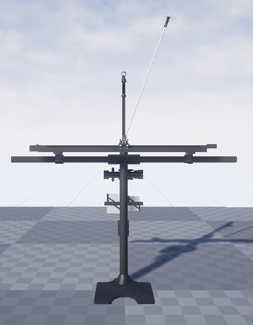

# UE4 - Inverted Pendulum

Old Unreal Enigne 4 wiki - https://nerivec.github.io/old-ue4-wiki/index.html

Helpful links for infomration:
* https://forums.unrealengine.com/t/local-udp-broadcast-with-fsocket/71815/2
* http://unreal.msd-ordc.com/2019/05/09/creating-network-sockets-in-c/
* https://forums.unrealengine.com/t/tcp-socket-listener-receiving-binary-data-into-ue4-from-a-python-script/7549
* https://forums.unrealengine.com/t/udp-sender-socket-stops-working-after-1-minute/102510/3
* https://answers.unrealengine.com/questions/25505/compiling-within-the-editor-complains-about-change.html
* https://github.com/is-centre/udp-ue4-plugin-win64
* https://github.com/getnamo/udp-ue4/blob/master/Source/UDPWrapper/Public/UDPComponent.h
* https://nerivec.github.io/old-ue4-wiki/pages/udp-socket-sender-receiver-from-one-ue4-instance-to-another.html
* https://docs.unrealengine.com/4.27/en-US/ProgrammingAndScripting/ProgrammingWithCPP/UnrealArchitecture/TArrays/

### Functionaly from Unreal enigne used

Sockets and networking:
* Modules: "Sockets", "Networking"
* FSocket
* UDPSocketBuilder, UDPSocketSender

Threading:
* FRunnable